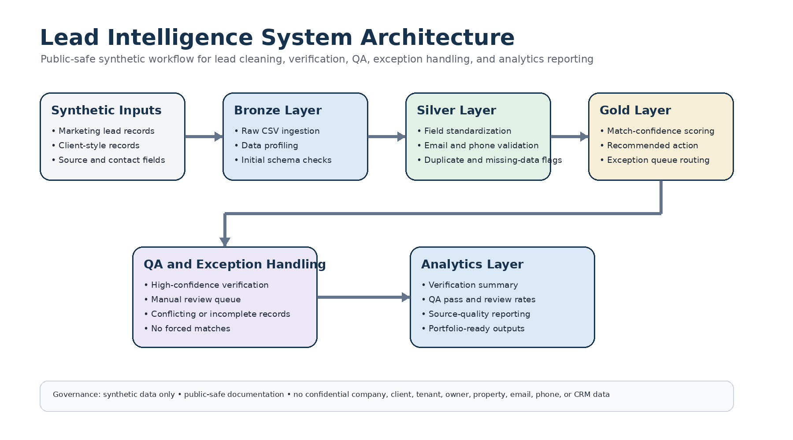

# 🧠 Lead Intelligence System


A public-safe synthetic lead intelligence system for marketing analytics, CRM-style data validation, match-confidence scoring, exception routing, and analytics-ready reporting.

This project demonstrates how raw marketing lead records can be cleaned, standardized, compared against client-style records, routed through QA review, and converted into structured reporting outputs for growth operations.

This repository uses synthetic data only. No confidential company data, client records, owner information, tenant data, property addresses, emails, phone numbers, CRM exports, internal spreadsheets, Gmail content, or private company files are included.

---

## 👤 Recruiter Summary

This project demonstrates my ability to turn a messy lead-management workflow into a structured data quality and verification system.

I designed a synthetic lead intelligence workflow that takes raw marketing leads, cleans and standardizes contact and source fields, compares leads against client-style records, assigns match-confidence levels, routes uncertain records into an exception queue, and prepares analytics-ready verification summaries.

The project connects technical execution with marketing operations: Python, pandas, QA validation, CRM-style matching logic, exception handling, data governance, and growth reporting.

---

## 🧩 Portfolio Positioning

This project is positioned as a technical marketing operations, CRM data quality, and growth analytics system.

It shows how a business-development workflow can be redesigned into a structured operating system with:

* Defined data layers
* Repeatable cleaning rules
* Match-confidence scoring
* QA validation
* Exception queue routing
* Analytics-ready reporting
* Public-safe documentation

The goal is to show practical experience across marketing analytics, data operations, CRM workflow design, automation planning, and data governance.

---

## 📊 Synthetic Output Metrics


The pipeline currently includes completed synthetic output files generated from mock lead and client-style records.

| Metric | Synthetic Output |
|---|---:|
| Synthetic marketing lead records | 25 |
| Synthetic client-style records | 45 |
| High-confidence matches | 17 |
| Medium-confidence matches | 0 |
| Low-confidence matches | 0 |
| No-match records | 1 |
| Exception queue records | 7 |
| Duplicate leads flagged | 2 |
| Invalid email records | 1 |
| Invalid phone records | 2 |
| QA pass records | 17 |
| QA review records | 8 |
| QA fail records | 0 |
| Verified match rate | 68.0% |
| Exception review rate | 28.0% |
| QA pass rate | 68.0% |

These metrics are based on synthetic data only and are included to demonstrate pipeline design, QA logic, exception routing, and analytics-ready reporting.

---

## ✨ Project Highlights

* Designed a medallion-style workflow using Bronze, Silver, Gold, and Analytics layers.
* Created a public-safe lead intelligence workflow using synthetic data.
* Built synthetic raw marketing lead and client-style datasets.
* Implemented data cleaning and standardization scripts using Python and pandas.
* Implemented match-confidence logic for lead-to-client style verification.
* Created QA rules for missing fields, invalid emails, invalid phones, duplicate leads, and conflicting records.
* Designed an exception queue to separate uncertain records instead of forcing unsupported matches.
* Generated analytics outputs for match status, QA status, exception counts, and verification readiness.
* Added QA validation tests to check output structure, approved status values, and summary reconciliation.
* Kept all documentation public-safe and synthetic.

---

## 📈 Business Impact

This project shows how a manual lead verification workflow can be converted into a repeatable data and analytics system.

The pipeline is designed to improve the workflow by:

* Turning raw marketing leads into standardized records
* Reducing manual review through structured cleaning rules
* Separating verified records from uncertain records
* Preventing unsupported assumptions during matching
* Creating QA logic for incomplete, duplicate, or conflicting records
* Supporting cleaner attribution and source quality analysis
* Making lead verification status easier to report

The main value is not only lead tracking. The value is building a cleaner operating system for growth operations, marketing analytics, and client verification.

---

## 🎯 Project Objective

The objective of this project is to demonstrate how a raw lead-management workflow can be turned into a repeatable lead intelligence system.

Workflow:

```text
Raw marketing lead records
↓
Cleaned and standardized lead data
↓
Client-style record comparison
↓
Match-confidence scoring
↓
Exception queue routing
↓
QA validation
↓
Analytics-ready reporting
````

---

## 💼 Business Problem

Marketing and business-development teams often collect leads from multiple sources, but the records are not always clean, complete, or easy to connect back to verified client outcomes.

Common issues include:

* Inconsistent lead source names
* Missing or invalid contact information
* Duplicate lead records
* Incomplete property or client profile fields
* Unclear conversion status
* Weak connection between marketing leads and client records
* No standardized exception queue
* Limited visibility into which records are verified, uncertain, or unusable

Without a structured workflow, teams risk inaccurate reporting, duplicate outreach, weak attribution, and unsupported assumptions.

---

## 👩‍💻 My Role

I structured this project as a public-safe reconstruction of a real growth operations workflow.

My responsibilities represented in this project include:

* Designing the lead intelligence workflow
* Defining synthetic raw and client-style datasets
* Structuring data cleaning and standardization rules
* Creating match-confidence logic
* Designing exception categories
* Planning QA validation checks
* Creating analytics-ready output structures
* Documenting the workflow using synthetic data only

---

## 🏗️ Data Architecture



| Layer        | Folder                | Purpose                                                |
| ------------ | --------------------- | ------------------------------------------------------ |
| 🥉 Bronze    | `datasets/raw/`       | Synthetic raw marketing leads and client-style records |
| 🥈 Silver    | `datasets/cleaned/`   | Cleaned and standardized records                       |
| 🥇 Gold      | `outputs/`            | Match results and exception queue outputs              |
| 📊 Analytics | `datasets/analytics/` | Lead verification summary metrics                      |

---

## 🔄 Pipeline Workflow

### 1. Bronze Layer: Raw Lead Data

The raw layer represents marketing lead records and client-style records before cleaning.

Example lead fields:

* `lead_id`
* `lead_created_date`
* `lead_source`
* `source_category`
* `contact_name`
* `contact_email`
* `contact_phone`
* `property_city`
* `property_type`
* `estimated_units`
* `lead_status`

Example client-style fields:

* `client_id`
* `client_name`
* `client_email`
* `client_phone`
* `property_city`
* `property_type`
* `managed_units`
* `client_status`

---

### 2. Silver Layer: Cleaned Records

The silver layer standardizes fields and prepares records for matching.

Cleaning steps include:

* Standardizing column names
* Cleaning contact names
* Normalizing phone numbers
* Validating email format
* Standardizing city names
* Standardizing property type values
* Creating units buckets
* Flagging missing contact fields
* Flagging duplicate records
* Assigning preliminary QA status

Generated files:

* `datasets/cleaned/cleaned_marketing_leads.csv`
* `datasets/cleaned/cleaned_client_records.csv`

---

### 3. Gold Layer: Match Results and Exception Queue

The gold layer creates verification-ready outputs.

Match result fields include:

* `lead_id`
* `client_id`
* `match_status`
* `match_confidence`
* `email_match`
* `phone_match`
* `name_similarity_score`
* `city_match`
* `property_type_match`
* `units_bucket_match`
* `recommended_action`
* `qa_status`
* `qa_notes`

Exception queue fields include:

* `exception_id`
* `lead_id`
* `exception_type`
* `match_issue`
* `review_priority`
* `recommended_next_step`
* `qa_status`
* `public_safe_notes`

Generated files:

* `outputs/client_match_results_mock.csv`
* `outputs/exception_queue_mock.csv`

---

### 4. Analytics Layer: Verification Reporting

The analytics layer summarizes match quality, QA status, and review readiness.

Analytics metrics include:

* Total leads
* Total client-style records
* High-confidence matches
* Medium-confidence matches
* Low-confidence matches
* No-match records
* Exception queue records
* Duplicate leads flagged
* Invalid email records
* Invalid phone records
* QA pass count
* QA review count
* QA fail count
* Verified match rate
* Exception review rate
* QA pass rate

Generated files:

* `datasets/analytics/raw_data_profile_mock.csv`
* `datasets/analytics/lead_verification_summary_mock.csv`

---

## 🧠 Match-Confidence Logic

| Match Status            | Description                                                      |
| ----------------------- | ---------------------------------------------------------------- |
| High Confidence Match   | Strong match signals exist across contact or profile fields      |
| Medium Confidence Match | Partial match signals exist, but review is recommended           |
| Low Confidence Match    | Weak match signals exist and manual verification is required     |
| No Match                | No reliable matching signals found                               |
| Exception               | Conflicting or incomplete information requires structured review |

Example rules:

High-confidence match:

* Email match or phone match
* City match
* Property type alignment
* Unit bucket alignment
* No conflicting client status
* No major QA issue

Medium-confidence match:

* Name similarity match
* City match
* Partial property type or units bucket alignment
* Review recommended before applying

Low-confidence match:

* Weak name similarity only
* Missing email or phone
* Conflicting city, property type, or unit data

Exception:

* Possible match exists, but the record requires human review before classification

---

## 🧪 QA and Exception Handling

The project includes QA logic for:

* Missing lead IDs
* Missing source values
* Missing or invalid emails
* Missing or invalid phone numbers
* Duplicate lead records
* Conflicting match signals
* Incomplete client-style records
* Records requiring manual review

Exception categories include:

* Duplicate Review
* Missing Contact Review
* Conflicting Status Review
* Source Attribution Review
* Client/Profile Review
* Better Export Needed
* No Reliable Match Found

Core QA principle:

```text
Do not force a match when the data is incomplete, conflicting, or unsupported.
```

---

## 🧾 Generated Output Files

| File                                                    | Purpose                                |
| ------------------------------------------------------- | -------------------------------------- |
| `datasets/analytics/raw_data_profile_mock.csv`          | Profiles raw synthetic input files     |
| `datasets/cleaned/cleaned_marketing_leads.csv`          | Cleaned synthetic marketing leads      |
| `datasets/cleaned/cleaned_client_records.csv`           | Cleaned synthetic client-style records |
| `outputs/client_match_results_mock.csv`                 | Match-confidence results               |
| `outputs/exception_queue_mock.csv`                      | Records routed to manual review        |
| `datasets/analytics/lead_verification_summary_mock.csv` | Final synthetic verification summary   |

---

## ▶️ How to Run the Pipeline

Install dependencies:

```bash
pip install -r requirements.txt
```

Run the full pipeline:

```bash
python run_pipeline.py
```

Run tests:

```bash
pytest
```

---

## 📂 Repository Structure

```text
lead-intelligence-system/
├── datasets/
│   ├── raw/
│   ├── cleaned/
│   └── analytics/
├── docs/
├── scripts/
│   ├── bronze/
│   ├── silver/
│   ├── gold/
│   └── analytics/
├── tests/
├── images/
├── outputs/
├── README.md
├── requirements.txt
├── LICENSE
├── .gitignore
└── run_pipeline.py
```

---

## 🛠️ Tools Represented

* Python
* pandas
* CSV-based data workflows
* CRM-style record matching
* QA validation logic
* Marketing analytics reporting
* GitHub documentation

---

## 🎯 Role Alignment

This project supports roles such as:

* Marketing Analyst
* Growth Marketing Analyst
* Data Analyst
* Marketing Operations Analyst
* Revenue Operations Analyst
* CRM Data Analyst
* Technical Marketing Analyst
* AI / Data Workflow Builder

---

## 🧠 Skills Demonstrated

* Data cleaning
* Data validation
* Lead intelligence design
* CRM-style matching logic
* Match-confidence scoring
* Exception queue routing
* QA rule design
* Synthetic data modeling
* Growth operations reporting
* Data governance
* Confidentiality-safe portfolio presentation
* Python pipeline design
* Analytics-ready output generation

---

## 🔒 Confidentiality Notice

This repository is a public-safe reconstruction of a real growth operations workflow.

It does not include:

* Real company data
* Real client records
* Real owner names
* Real tenant names
* Real property addresses
* Real emails
* Real phone numbers
* Real CRM exports
* Real AppFolio exports
* Real LeadSimple exports
* Internal Google Sheets
* Internal email messages
* Internal dashboard screenshots
* Internal execution logs
* Raw Drive documents
* Any confidential company data

All records, examples, files, and outputs are synthetic or generalized for portfolio demonstration.

---

## ✅ Status

This repository is portfolio-ready.

Completed components include:

* Synthetic raw marketing lead dataset
* Synthetic client-style record dataset
* Bronze raw data profiling script
* Silver data cleaning script
* Gold match-results and exception queue script
* Analytics verification summary script
* Generated synthetic output files
* QA validation test file
* Public-safe documentation and case study

Future enhancements may include:

* Streamlit dashboard layer
* Visual KPI screenshots
* Source-quality analytics
* Match-confidence distribution charts
* Automated GitHub Actions workflow

---

## 🌱 About This Project

This project is designed to show how marketing operations work can be structured like a technical data system.

The goal is to demonstrate that growth work is not only campaign execution. It can include data architecture, QA logic, record matching, exception handling, reporting workflows, and business-development systems.
Update README with actual synthetic output metrics
````
